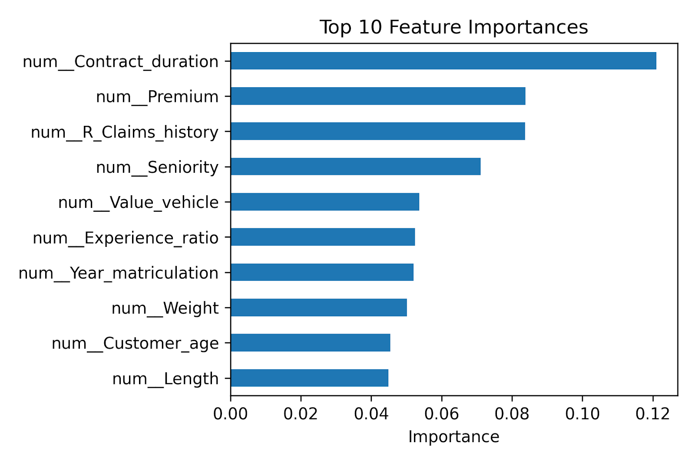

# Auto Insurance Renewal Prediction using Machine Learning

Predicting whether an auto insurance customer will renew their contract using supervised machine learning models and targeted feature engineering.

- [Research Paper (PDF)](Reports/Written_Report.pdf)  
- [Final Presentation (PDF)](Reports/Final_Presentation.pdf)

**Data Set:** [Lledó, Josep (2023), “Dataset of an actual motor vehicle insurance portfolio”, Mendeley Data, V1](https://doi.org/10.17632/5cxyb5fp4f.1)  

## Methodology
### Data Preprocessing
- Removed outliers (e.g., unrealistic ages or driving experience)  
- Engineered new features:
  - `Customer_age`, `Driving_experience`, `Contract_duration`, `Experience_ratio`  
- Created target variable `Renewal` (1 = renewed, 0 = not renewed)  
- Normalized continuous features and dropped redundant columns  

### Data Analysis

Correlation patterns and model-derived feature importance were examined to understand relationships between variables and their impact on renewal predictions.

  <table>
    <tr>
      <td align="center" width="50%">
        
         
      </td>
      <td align="center" width="50%">
        
         
      </td>
    </tr>
  </table>

## Results
Gradient Boosting achieved the strongest overall performance across all evaluation criteria.

| Model | Accuracy | F1-Score | ROC-AUC | Summary |
|:------|:----------|:----------|:----------|:----------|
| Linear Regression | 79.4% | 0.54 | 0.62 | Underfitted, poor for nonlinear data |
| Random Forest | 83.2% | 0.90 | 0.839 | Strong recall, interpretable results |
| **Gradient Boosting** | **90.3%** | **0.94** | **0.893** | Best balance of performance and generalization |